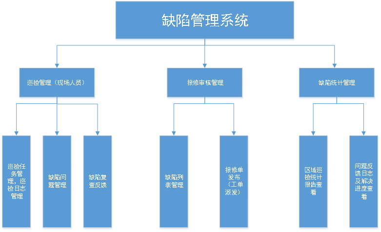

# defect-management-system
 <h3>项目说明:</h3>  
<h4>一、项目背景：</h4>
电力系统管理中，需要定期检修保养维护生成检查报告并向上提交，经由管理审核的评估确认过后，是否生成新的检修工单并发布。该缺陷管理系统可分为电脑端和手机端双端配合，通过定位、拍照、信息提交等将缺陷的检查报告提交并进入审核、派发流程。通过双端配合，更便捷和迅速的处理电力系统的缺陷和问题。
  
 <h4>二、用户与角色：</h4> 
1.现场巡检人员：
查看巡检区域，执行巡检任务。
对缺陷检修信息进行填报。
提交缺陷信息。
处理审核驳回的缺陷报告单（确认后再次提交或者删除）。
缺陷修复完成后生成复检报告，复检完成后提交复检审核。

2.缺陷审核管理人员：
给巡检人员派发区域范围的巡检任务。
审核确认现场巡检人员提交的检修申请。
对存在缺陷的进行缺陷修复工单的派发，对无缺陷的检修申请进行驳回。
修复的工单完成后给巡检派发复检任务。
审核复检报告，检修通过则完成检修流程，不通过则进入缺陷审核流程。

3.上级管理人员：
查看总的区域的巡检进度和缺陷问题统计。
查看编辑每个相关的巡检人员、审核人员相关等。

<h4>三、开发流程简介：</h4> 
1.项目需求分析，确定系统功能及结构，完成数据模型建立，数据库表设计

2.在resources文件夹下创建application.yml文件，配置数据源，开启隐藏请求方法，使用RESTful风格的接口。

3.使用Mybatis的自动生成工具成实体类和相关持久层文件
在实体类上使用注解@Data @TableName(value = "表名")自动生成getter、setter和建立表和实体类的映射关系
在缺陷问题管理表中维护区域表和员工表的关系。在启动类中开启@MapperScan("持久层文件位置"),配置mapper-locations: classpath:文件路径/*.xml

4.让实体类继承model<实体类>（mybatis-plus方法）实现Serializable(序列化), IExcelModel, IExcelDataModel(easypoi的方法)接口，并删除repository文件夹下的mapper文件和mapper.xml文件中的数据库相关方法，并继承BaseMapper<实体类>

5.创建controller文件夹，创建每个角色对应的controller和登录跳转等相关的controller(使用restful风格的请求)。根据接口文档编写对应的mapping的请求路径和处理请求的方法名，使用@Autowired注入需要的业务层及相关对象，在方法下调用业务层方法并将封装的结果返回给前端对应页面。

6.编写业务层方法，创建接口及接口实现类，创建工具类和工具方法，创建配置文件夹和配置类。